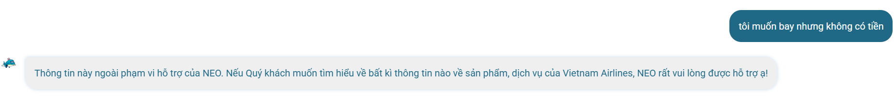

# Lab 5 - Mổ App AI Thật

## 1. Chọn một sản phẩm để dùng thử

Lựa chọn Neo từ Vietnam Airline làm sản phẩm dùng thử

## 2. Dùng thử: promise vs reality

Feature: Ask Neo giúp user muốn đặt vé nhưng tài chính eo hẹp

User được hứa sẽ được giúp: Tìm vé rẻ, Khuyến mãi, Trả góp / thanh toán sau,...

Task sẽ thử: Hỏi Neo rằng muốn bay nhưng không có tiền

**Evidence:**



## 3. Vẽ 4 paths

| Path | Câu hỏi cần trả lời |
| --- | --- |
| Happy | Nếu user hỏi rõ “tôi muốn mua vé máy bay nhưng không có tiền” thì AI có thể trả lời đúng về promotion / booking. |
| Low-confidence | Không xuất hiện. Với câu mơ hồ, NEO không hỏi lại mà reject là ngoài phạm vi. |
| Failure | AI hiểu câu “muốn bay nhưng không có tiền” là ngoài phạm vi, dù có thể liên quan tới vé rẻ / khuyến mãi / thanh toán. |
| Correction | Nếu user tự sửa prompt thành “tôi muốn mua vé máy bay nhưng không có tiền” thì AI có thể tiếp tục, nhưng correction do user tự làm; hệ thống không học hoặc log visible. |

## 4. Viết finding thành quyết định

Khi user diễn đạt nhu cầu bay bằng ngôn ngữ đời thường “tôi muốn bay nhưng không có tiền”,

NEO đánh giá intent là ngoài phạm vi thay vì hỏi lại hoặc gợi ý các lựa chọn liên quan như vé khuyến mãi, giá rẻ, dùng dặm, voucher, hoặc phương thức thanh toán phù hợp,

hậu quả là user bị chặn khỏi hành trình mua vé dù nhu cầu vẫn thuộc domain của Vietnam Airlines.

Lỗi thuộc layer intent và UX recovery.

Nên sửa bằng requirement: với các câu nói mơ hồ nhưng liên quan đến nhu cầu bay, NEO phải hỏi lại để xác định intent hoặc show các option hợp lệ thay vì kết luận ngoài phạm vi.

Finding này sẽ đổi SPEC bằng cách thêm intent rule cho các câu mơ hồ nhưng còn liên quan đến nhu cầu bay: NEO không được reject ngay là ngoài phạm vi, mà phải hỏi lại hoặc đưa các option như vé rẻ, khuyến mãi, dùng dặm, voucher, hoặc thanh toán.

## 5. Sketch as-is / to-be

```text
            AS-IS                                      TO-BE

User:                                   User:

“Tôi muốn bay nhưng không có tiền”      “Tôi muốn bay nhưng không có tiền”

↓                                                       ↓

NEO hiểu là ngoài phạm vi               NEO hiểu: muốn bay + thiếu tiền

↓                                                       ↓

NEO từ chối hỗ trợ                      NEO hỏi lại / đưa lựa chọn

↓                                                       ↓

[ĐIỂM GÃY]                              - Tìm vé giá thấp

User không được dẫn tới                 - Xem khuyến mãi

vé rẻ / khuyến mãi / thanh toán         - Dùng dặm Lotusmiles

    ↓                                   - Xem phương thức thanh toán

User phải tự nghĩ lại cách hỏi                          ↓

                                        User chọn option

                                                        ↓

                                        NEO dẫn tới flow phù hợp

```

## 6. Tự kiểm trước khi nộp

Có ít nhất 1 screenshot hoặc observation cụ thể.

Có đủ 4 paths hoặc nói rõ path nào chưa có trong product.

Finding được viết thành product decision, không chỉ là nhận xét.

Sketch có as-is và to-be.

Có một câu nói rõ finding này sẽ đổi gì trong SPEC.
